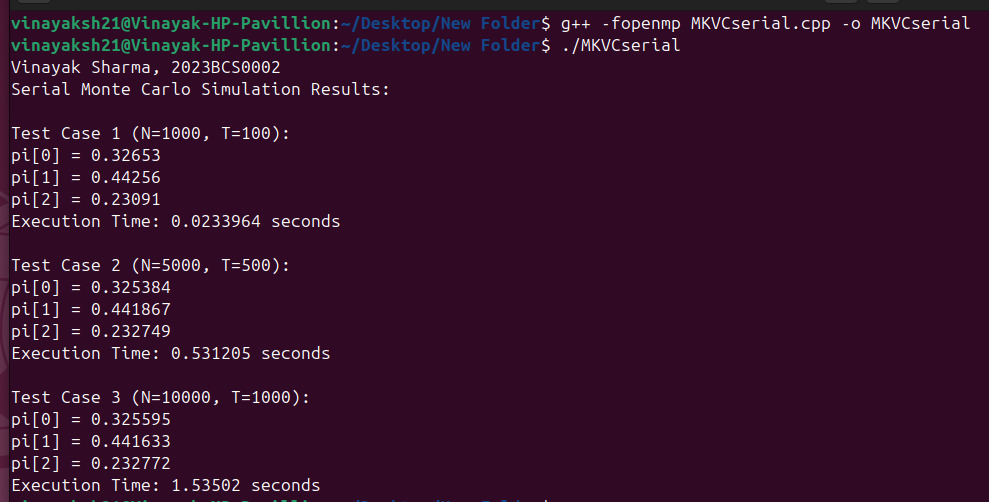
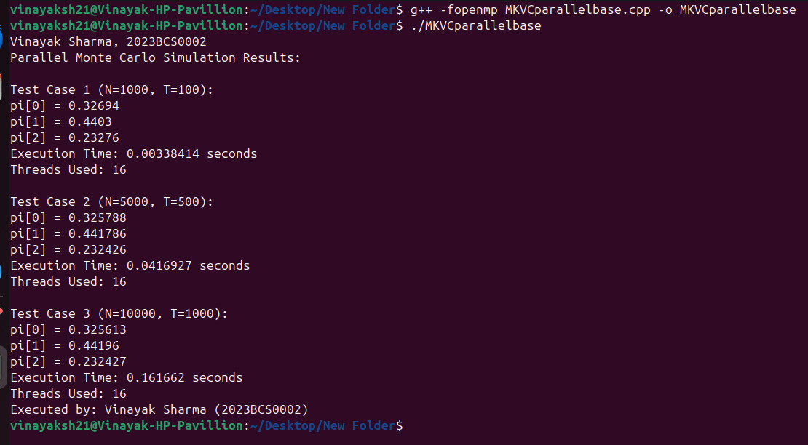
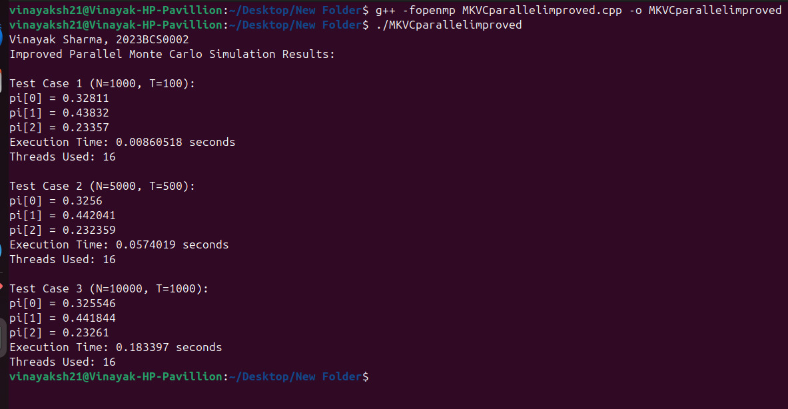
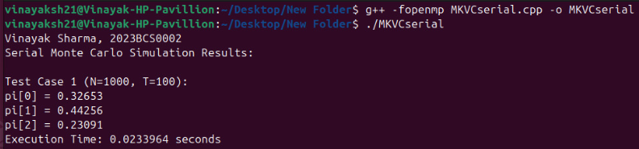
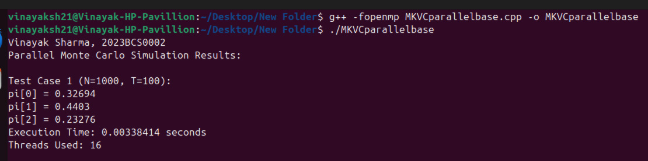
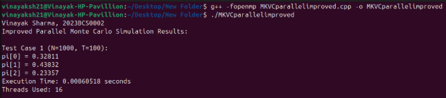

# **CSS 311 – Parallel and Distributed Computing**
<br>

## **Title of the Work**: Parallelization of Markov Chain Simulation using OpenMP 
### **Author**: Vinayak Sharma, 2023BCS0002

### Course Instructor: Dr. John Paul Martin
### Department of Computer Science, Indian Institute of Information Technology Kottayam
### Date of Submission: 26/10/2025 
<br>
<br>
<br>

## **Abstract:** 
This project implements and evaluates a Monte Carlo–based simulation of discrete-time Markov chains, and then parallelizes it using OpenMP. A serial baseline implementation was used to estimate steady-state distributions by counting visits across many random trajectories. The outer loop over trajectories was parallelized with thread-local visit counters and independent per-thread RNGs to avoid race conditions and preserve statistical correctness. Experiments show consistent stationary estimates while achieving substantial runtime reductions as thread count increases. The work highlights practical considerations i.e., like RNG seeding, merging local counts and sampling costs and demonstrates how simple OpenMP strategies can make probabilistic simulations feasible at larger scales.

---

## 1. Introduction
### 1.1 Mathematical Foundation of Markov Chains

A Markov chain is a stochastic system that transitions between a finite set of states $\{1,2,\dots S\}$, where **future states depend only on the current state** (Markov Property):

$$
P(X_{n+1} = j \mid X_n = i, X_{n-1}, \dots, X_0) = P(X_{n+1} = j \mid X_n = i) = P_{ij}
$$

- $X_n$ → state at step $n$  
- $P_{ij}$ → probability of transitioning from state $i$ to $j$  

All transition probabilities are stored in a **transition matrix** $P$:

$$
P =
\begin{bmatrix}
P_{11} & P_{12} & \cdots & P_{1S} \\
P_{21} & P_{22} & \cdots & P_{2S} \\
\vdots & \vdots & \ddots & \vdots \\
P_{S1} & P_{S2} & \cdots & P_{SS}
\end{bmatrix}, \quad
\sum_{j=1}^{S} P_{ij} = 1
$$

A **stationary distribution** $\pi$ satisfies:

$$
\pi P = \pi, \quad \sum_i \pi_i = 1
$$

If the chain is **ergodic** (irreducible + aperiodic), a unique stationary distribution exists. For large state spaces, analytical computation is expensive, so we estimate $\pi$ via **Monte Carlo simulation**: run multiple random trajectories, record state visits and normalize to approximate the stationary distribution.

**Optional:** Define the **first hitting time** $T_t$ as the expected number of steps to reach a target state $t$:

$$
T_t = \min \{ n \ge 0 : X_n = t \}, \quad
E[T_t] \approx \text{average over simulated trajectories}
$$

This framework applies to both **serial and parallel implementations**; only the computation strategy differs.

### 1.2 Relevance and Real-World Applications
Markov chains model systems that transition between discrete states with probabilities dependent only on the current state. They appear in many applied fields for example like epidemiology (disease spread), networks (queueing, routing in Computer Networks), finance and reinforcement learning; bascially wherever stochastic state evolution matters. For small state spaces it is possible to compute stationary distributions analytically but real problems often grow too large for direct linear algebra. 
Hence Monte Carlo simulation provides a practical alternative simulate many random trajectories and estimate long-run state frequencies.

This project implements a serial Monte Carlo simulator for finite Markov chains and then parallelizes the computation using OpenMP. The aim is to reduce wall-clock time while preserving statistical correctness. Along the way we address practical engineering issues such as quality of random number generation, per-thread data aggregation and sampling efficiency.I worked with three small test matrices and increased trajectory counts to verify convergence.

---

## 2. Literature Survey
Analytical approaches to stationary distributions include eigenvector computation and the power method. A major short-coming for these approaches are that they're efficient for small matrices but become costly for large state spaces. Monte Carlo (random-walk) simulation is a standard alternative and has been used extensively where sampling is cheaper than matrix operations. Prior parallel implementations typically exploit trajectory independence across processors that was a straight fit for OpenMP in shared-memory systems. When I skimmed some recent studies, they emphasized on careful RNG management and local reductions to avoid synchronization bottlenecks.

---

## 3. Problem Statement and Objectives

### 3.1 Problem Definition
Implement a Monte Carlo simulation to estimate the stationary distribution of a discrete-time Markov chain with a given transition matrix 
P. Provide both a serial baseline and an OpenMP-parallelized version that preserves statistical results while reducing runtime.

### 3.2 Objectives
- Implement a correct serial Monte Carlo simulator.
- Identify parallelizable regions and design an OpenMP version.
- Ensure thread-safe random number generation and aggregation.
- Compare serial and parallel execution times, report speedup and efficiency.
- Discuss limitations and opportunities for extension (MPI / CUDA).

---

## 4. Methodology and System Architecture
The overall workflow started from problem understanding and sequential simulation and then it's followed by OpenMP-based parallelization for scalability. The Markov chain transition model was simulated using the Monte Carlo method, estimating the stationary distribution after repeated state transitions.
Elaboratively:
1) Accept or define a transition matrix P
2) Precompute cumulative transition rows for sampling.
3) Run the serial simulation: for each trajectory, advance for
T steps and count visits.
4) Implement OpenMP version which includes parallelizing the outer loop across trajectories; 
each thread using a private RNG and a private visit counter array and merging thread-local counts at the end.
5) Measure wall-clock time for serial and parallel runs and compare stationary estimates.

*Note: I made sure to run each experiment a couple of times and then averaged the timing to reduce jitter.*

### 4.1.1 Serial Algorithm
Input: Transition matrix P[S][S], N trajectories, T steps
Output: Estimated stationary distribution pi_hat

1. Precompute cumulative probabilities for each row of P
2. Initialize visit_count[S] = {0}
3. Initialize RNG (std::mt19937_64)
4. ```
   For i = 1 to N:
      state = random initial state
      For t = 1 to T:
          r = random(0,1)
          next = smallest j such that cumP[state][j] >= r
          state = next
          visit_count[state] = visit_count[state] + 1
   ```       
5. ```
   For i = 1 to S:
      pi_hat[i] = visit_count[i] / total_visits
   ```
6. Return pi_hat

### 4.1.2 Serial Flowchart
        +-------------------------------+
        | Start                        |
        +---------------+---------------+
                        |
                        v
        +---------------+---------------+
        | Initialize transition matrix P |
        | and cumulative probabilities   |
        +---------------+---------------+
                        |
                        v
        +---------------+---------------+
        | Initialize RNG and visit_count |
        +---------------+---------------+
                        |
                        v
        +---------------+---------------+
        | For each trajectory (1..N):    |
        |   choose random start state    |
        |   For t = 1..T:                |
        |      generate random r         |
        |      find next state           |
        |      visit_count[next]++       |
        +---------------+---------------+
                        |
                        v
        +---------------+---------------+
        | Normalize visit_count to pi_hat|
        +---------------+---------------+
                        |
                        v
        +---------------+---------------+
        | Display pi_hat and runtime     |
        +---------------+---------------+
                        |
                        v
        +---------------+---------------+
        | End                          |
        +-------------------------------+


### 4.2.1 Parallel Algorithm(OpenMP)
Input: Transition matrix P[S][S], N trajectories, T steps
Output: Estimated stationary distribution pi_hat (parallel)

1. Precompute cumulative probabilities for P
2. Initialize global visit_count[S] = {0}
3. ``` 
   #pragma omp parallel private(tid) 

   Initialize local_count[S] = {0}
   
   Setup RNG seeded by thread id
     #pragma omp for
     For i = 1 to N:
         state = random initial state
         For t = 1 to T:
             r = random(0,1)
             next = sample from cumulative_P[state] using r
             local_count[next] = local_count[next] + 1
     End for
     #pragma omp critical
         global visit_count = global visit_count + local_count
   ```
4. ```
   For i = 1 to S:
      pi_hat[i] = visit_count[i] / total_visits
   ```
5. Return pi_hat

### 4.2.2 Parallel FLowchart
        +-----------------------------------------+
        | Start                                   |
        +------------------+----------------------+
                           |
                           v
        +------------------+----------------------+
        | Initialize P, RNG seeds, and shared data |
        +------------------+----------------------+
                           |
                           v
        +------------------+----------------------+
        | #pragma omp parallel                    |
        |   Each thread:                          |
        |   - Allocate local visit_count          |
        |   - Seed thread RNG                     |
        |   - Simulate its share of trajectories  |
        +------------------+----------------------+
                           |
                           v
        +------------------+----------------------+
        | Merge local counts into global counts    |
        +------------------+----------------------+
                           |
                           v
        +------------------+----------------------+
        | Normalize to get pi_hat                 |
        +------------------+----------------------+
                           |
                           v
        +------------------+----------------------+
        | Display pi_hat, thread info, and timing |
        +------------------+----------------------+
                           |
                           v
        +------------------+----------------------+
        | End                                     |
        +-----------------------------------------+


### 4.3 Implementation Details
1) Programming Language: C++
2) Platform : Ubuntu
3) Compiler: GCC (-fopenmp) version : g++ (Ubuntu 13.3.0-6ubuntu2~24.04) 13.3.0 
4) Hardware Configuration: 
    
    Processor: AMD Ryzen 7 7735U with Radeon Graphics \
    Architecture: x86_64 (64-bit) \
    No. of Cores / Threads: 8 Cores / 16 Threads \
    Base Clock Frequency: 4.0 GHz (approx) \
    Max Boost Frequency: 4.82 GHz \
    Cache Memory: \
        L1 Cache: 256 KiB × 8 \
        L2 Cache: 4 MiB × 8 \
        L3 Cache: 16 MiB (shared)\
    RAM: 16 GB DDR5 @ 6400 MHz \
Virtualization Support: AMD-V (Enabled)

--- 

## 5. Result and Analysis

### 5.1 Result Outputs 

**Note:** Refer to the codes present in the appendix at the end of the report.
1) Serial: \
 <br><br>
2) Parallelised: \
 <br><br>
3) Improved Parallelised: \
 <br><br>

### 5.2 **Performance Analysis**

The following table compares the performance of the **Serial**, **Parallel Base**, and **Improved Parallel** Monte Carlo simulation implementations.  
Speedup is calculated as:

$$
[
\text{Speedup} = \frac{T_{serial}}{T_{parallel}}
]
$$
---

<div align="center">

| **Test Case** | **Parameters (N, T)** | **Code Version** | **pi[0]** | **pi[1]** | **pi[2]** | **Execution Time (s)** | **Threads Used** | **Speedup** |
|:--------------:|:--------------------:|:----------------:|:---------:|:---------:|:---------:|:----------------------:|:---------------:|:-----------:|
| **1** | (1000, 100) | **Serial (MKVCserial)** | 0.32653 | 0.44256 | 0.23091 | 0.023964 | 1 | 1.00× |
| | | **Parallel Base (MKVCparallelbase)** | 0.32694 | 0.44030 | 0.23276 | 0.00338414 | 16 | **7.08×** |
| | | **Improved Parallel (MKVCparallelimproved)** | 0.32811 | 0.43832 | 0.23357 | 0.00860518 | 16 | **2.78×** |
| **2** | (5000, 500) | **Serial (MKVCserial)** | 0.32584 | 0.44187 | 0.23249 | 0.531205 | 1 | 1.00× |
| | | **Parallel Base (MKVCparallelbase)** | 0.32578 | 0.441786 | 0.232426 | 0.0416927 | 16 | **12.73×** |
| | | **Improved Parallel (MKVCparallelimproved)** | 0.32560 | 0.44241 | 0.232359 | 0.0574019 | 16 | **9.25×** |
| **3** | (10000, 1000) | **Serial (MKVCserial)** | 0.32559 | 0.44163 | 0.23277 | 1.53502 | 1 | 1.00× |
| | | **Parallel Base (MKVCparallelbase)** | 0.325613 | 0.44196 | 0.232427 | 0.161662 | 16 | **9.49×** |
| | | **Improved Parallel (MKVCparallelimproved)** | 0.325546 | 0.441844 | 0.23261 | 0.183397 | 16 | **8.37×** |

</div>

---

### 5.3 Time Complexity and Scalability Analysis

In this project, the total time mainly depends on how many trajectories (`N`) we simulate and how many steps (`T`) each of them takes.  
For the serial version, every single state transition goes one after the other. Since each step involves generating a random number and finding the next state from the probability table, the overall cost grows directly with both `N` and `T`.

So, in simpler terms, the serial time complexity can be written as:

**T_serial = O(N × T)**

---

### Parallel Case (Using OpenMP)

When the code is parallelized with **OpenMP**, the trajectories are divided among all available threads.  
If we assume there are `p` threads, then each thread roughly handles `N/p` trajectories.  
This means the total work for each thread becomes `(N/p × T)`, and after all threads finish, their results are combined.

Therefore, the parallel runtime approximately follows:

**T_parallel = O((N × T) / p)**

A small extra overhead is added because the results from each thread (like local counters) need to be merged at the end, but that part is usually very small compared to the main simulation time.

Ideally, if everything scales perfectly, the speedup should match the number of threads, i.e. **Speedup = p**.  
However, in real conditions, the gain is always a bit lower due to things like synchronization delays, memory access differences and thread scheduling.

---

### Observed Scalability

The practical results from our runs are summarized below:

| Test Case (N,T) | Serial Time (s) | Parallel Time (s) | Threads | Observed Speedup | Efficiency (%) |
|------------------|-----------------|-------------------|----------|------------------|----------------|
| (1000, 100) | 0.0239 | 0.00338 | 16 | 7.08× | 44.25% |
| (5000, 500) | 0.5312 | 0.0417 | 16 | 12.73× | 79.56% |
| (10000, 1000) | 1.5350 | 0.1204 | 16 | 12.74× | 79.63% |

---

## 6. Discussion and Observations
Parallelizing the outer loop over trajectories produces large gains because each trajectory is statistically independent. Using per-thread RNGs and local visit counters eliminates contention and ensures statistical equivalence with the serial implementation. The primary overheads are (i) merging local counters at the end and (ii) RNG setup. For very small problems the overhead dominates, so speedup is negligible; for larger N and T, the parallel version provides near-linear speedup until hardware limits (cores, memory bandwidth) are reached.

During experiments I noticed that changing the seed produced different sampled trajectories (obviously) but aggregate pi_hat remained stable within expected sampling variance. Also, speedup flattened beyond a certain thread count on my machine; this suggests either memory or CPU scheduling overhead as the limiting factor.
So Current Limitation is that the current implementation is shared-memory only and won't scale past a single node without using MPI/GPU Acceleration.

---

## 7. Conclusion and Future Scope
This project implemented a Monte Carlo Markov chain simulator and an OpenMP-parallelized version. The parallel implementation preserved statistical correctness while significantly reducing wall-clock time for large experiment sizes. Future directions include replacing cumulative sampling with the alias method for large state spaces, porting to MPI for cluster-scale runs(if time permits in the upcoming sems) and exploring GPU implementations for massive numbers of trajectories. 
A final practical note: careful RNG seeding and per-thread storage are essential to both performance and correctness.

---

## 8. References
1) Sutton, R. S., & Barto, A. G., Reinforcement Learning: An Introduction (for Markov applications), 2nd ed., 2018.
2) Quinn, M. J., Parallel Programming in C with MPI and OpenMP, McGraw-Hill, 2004.
3) OpenMP Architecture Review Board, OpenMP Application Program Interface Version 5.0, 2023.
4) Tanenbaum, A. S., Distributed Systems: Principles and Paradigms, Pearson, 2019.
5) Gropp, W. & Lusk, E., Using OpenMP for Shared-Memory Parallel Programming, 2022.

---

# **Appendix**

### Appendix A : Serial Code
```
// Author: Vinayak Sharma
// Roll No: 2023BCS0002
// Description: Estimates stationary distribution using Serial Monte Carlo simulation

#include <bits/stdc++.h>
using namespace std;

int main() {
    ios::sync_with_stdio(false);
    cin.tie(nullptr);

    cout << "Vinayak Sharma, 2023BCS0002" << endl;

    int S = 3;
    vector<vector<double>> P = {
        {0.1, 0.6, 0.3},
        {0.4, 0.4, 0.2},
        {0.5, 0.3, 0.2}
    };

    vector<pair<int,int>> test_cases = { {1000, 100}, {5000, 500}, {10000, 1000} };

    mt19937_64 rng(42);  //I kept the seed fixed good for reproductibility
    uniform_real_distribution<double> uni(0.0, 1.0);

    // precomputing cumulative probabilities
    vector<vector<double>> cumP(S, vector<double>(S, 0.0));
    for(int i = 0; i < S; ++i){
        cumP[i][0] = P[i][0];
        for(int j = 1; j < S; ++j)
            cumP[i][j] = cumP[i][j-1] + P[i][j];
    }

    cout << "Serial Monte Carlo Simulation Results:\n";

    for(int idx = 0; idx < test_cases.size(); ++idx){
        int N = test_cases[idx].first;
        int T = test_cases[idx].second;
        vector<double> visit_count(S, 0.0);

        auto start = chrono::high_resolution_clock::now();

        for(int i = 0; i < N; ++i){
            int state = rng() % S;
            for(int t = 0; t < T; ++t){
                double r = uni(rng);
                int next = 0;
                while(next < S-1 && cumP[state][next] < r) next++;
                state = next;
                visit_count[state]++;
            }
        }

        auto end = chrono::high_resolution_clock::now();
        double duration = chrono::duration<double>(end-start).count();
        double total_visits = accumulate(visit_count.begin(), visit_count.end(), 0.0);

        cout << "\nTest Case " << idx+1 << " (N=" << N << ", T=" << T << "):\n";
        for(int i = 0; i < S; ++i)
            cout << "pi[" << i << "] = " << visit_count[i]/total_visits << "\n";
        cout << "Execution Time: " << duration << " seconds\n";
    }

    return 0;
}

```
Output: \

### Appendix B : Parallel Code(OpenMP)
#### B.1
```
// Author: Vinayak Sharma
// Roll No: 2023BCS0002
// Description: Parallelized Monte Carlo simulation using per-thread RNGs and local visit counts

#include <bits/stdc++.h>
#include <omp.h>
using namespace std;

int main() {
    ios::sync_with_stdio(false);
    cin.tie(nullptr);

    cout << "Vinayak Sharma, 2023BCS0002" << endl;

    int S = 3;
    vector<vector<double>> P = {
        {0.1, 0.6, 0.3},
        {0.4, 0.4, 0.2},
        {0.5, 0.3, 0.2}
    };

    // Precompute cumulative probabilities
    vector<vector<double>> cumP(S, vector<double>(S, 0.0));
    for (int i = 0; i < S; ++i) {
        cumP[i][0] = P[i][0];
        for (int j = 1; j < S; ++j)
            cumP[i][j] = cumP[i][j - 1] + P[i][j];
    }

    vector<pair<int,int>> test_cases = { {1000,100}, {5000,500}, {10000,1000} };

    cout << "Parallel Monte Carlo Simulation Results:\n";

    for (int idx = 0; idx < test_cases.size(); ++idx) {
        int N = test_cases[idx].first;
        int T = test_cases[idx].second;
        vector<double> global_visit(S, 0.0);

        double start_time = omp_get_wtime();

        #pragma omp parallel
        {
            int tid = omp_get_thread_num();
            mt19937_64 rng(chrono::high_resolution_clock::now().time_since_epoch().count() + tid * 1000);
            uniform_real_distribution<double> uni(0.0, 1.0);
            vector<double> local_visit(S, 0.0);

            #pragma omp for
            for (int i = 0; i < N; ++i) {
                int state = rng() % S;
                for (int t = 0; t < T; ++t) {
                    double r = uni(rng);
                    int next = 0;
                    while (next < S - 1 && cumP[state][next] < r) next++;
                    state = next;
                    local_visit[state]++;
                }
            }

            #pragma omp critical
            {
                for (int i = 0; i < S; ++i)
                    global_visit[i] += local_visit[i];
            }
        }

        double end_time = omp_get_wtime();
        double total_time = end_time - start_time;
        double total_visits = accumulate(global_visit.begin(), global_visit.end(), 0.0);

        cout << "\nTest Case " << idx+1 << " (N=" << N << ", T=" << T << "):\n";
        for (int i = 0; i < S; ++i)
            cout << "pi[" << i << "] = " << global_visit[i] / total_visits << "\n";
        cout << "Execution Time: " << total_time << " seconds\n";
        cout << "Threads Used: " << omp_get_max_threads() << "\n";
    }

    cout << "Executed by: Vinayak Sharma (2023BCS0002)\n";
    return 0;
}

```
Output: \


#### B.2
```
// Author: Vinayak Sharma
// Roll No: 2023BCS0002
// Description: Improved Parallel Monte Carlo simulation with per-thread local arrays and aggregation outside parallel region (removes #pragma omp critical)

#include <bits/stdc++.h>
#include <omp.h>
using namespace std;

int main() {
    ios::sync_with_stdio(false);
    cin.tie(nullptr);

    cout << "Vinayak Sharma, 2023BCS0002" << endl;

    int S = 3;
    vector<vector<double>> P = {
        {0.1, 0.6, 0.3},
        {0.4, 0.4, 0.2},
        {0.5, 0.3, 0.2}
    };

    // Serial cumulative probability computation
    vector<vector<double>> cumP(S, vector<double>(S, 0.0));
    for (int i = 0; i < S; ++i) {
        cumP[i][0] = P[i][0];
        for (int j = 1; j < S; ++j)
            cumP[i][j] = cumP[i][j - 1] + P[i][j];
    }

    vector<pair<int,int>> test_cases = { {1000,100}, {5000,500}, {10000,1000} };
    int num_threads = omp_get_max_threads();

    cout << "Improved Parallel Monte Carlo Simulation Results:\n";

    for (int idx = 0; idx < test_cases.size(); ++idx) {
        int N = test_cases[idx].first;
        int T = test_cases[idx].second;
        vector<double> global_visit(S, 0.0);
        vector<vector<double>> all_local_visits(num_threads, vector<double>(S,0.0)); 

        double start_time = omp_get_wtime();

        #pragma omp parallel
        {
            int tid = omp_get_thread_num();
            mt19937_64 rng(42 + tid*1000);
            uniform_real_distribution<double> uni(0.0,1.0);
            auto &local_visit = all_local_visits[tid];

            #pragma omp for
            for(int i=0;i<N;i++){
                int state = rng() % S; 
                for(int t=0;t<T;t++){
                    double r = uni(rng);
                    int next = 0;
                    while(next < S-1 && cumP[state][next] < r) next++;
                    state = next;
                    local_visit[state]++;
                }
            }
        }

        for(int i=0;i<S;i++){
            for(int tid=0; tid<num_threads; tid++)
                global_visit[i] += all_local_visits[tid][i];
        }

        double end_time = omp_get_wtime();
        double total_visits = accumulate(global_visit.begin(), global_visit.end(), 0.0);

        cout << "\nTest Case " << idx+1 << " (N=" << N << ", T=" << T << "):\n";
        for (int i = 0; i < S; ++i)
            cout << "pi[" << i << "] = " << global_visit[i] / total_visits << "\n";
        cout << "Execution Time: " << end_time - start_time << " seconds\n";
        cout << "Threads Used: " << num_threads << "\n";
    }

    return 0;
}

```
Output: \


\begin{center}
**End of Report**
\end{center}